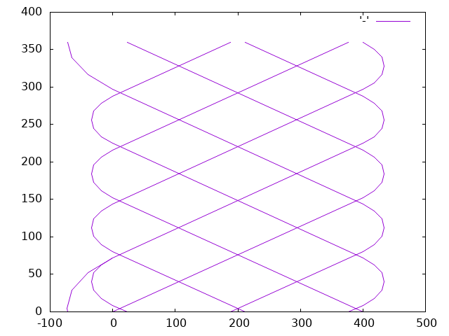
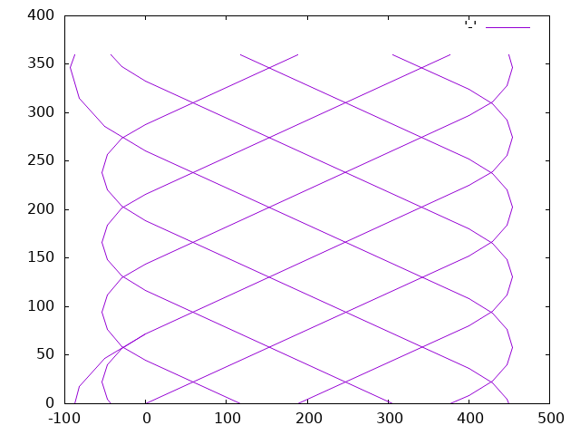
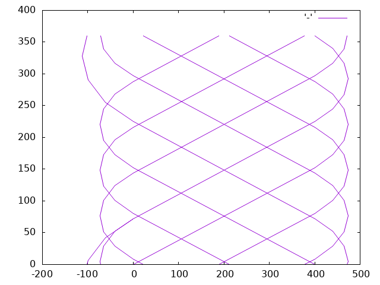

# Filament Winder path generator (fpg) and device

## License
  Published under the AGPLv3 license. Please see LICENSE.txt

  For any commercial interest, contact me : blog@tinkerbox.org

## Features

 ### Software

 - Generates G-Code meant to drive a 3-axis filament winder machine

 - Can also output coordinates wrapped around the Y axis, for plotting
   a graph (with GNUplot for example) to visually validate the
   expected winding pattern.

 - GenerateS information to choose best winding tow count, pattern and
   skip number depending on desired tube diameter, filament tow width
   and winding angle.

 - An essentIal design goal of the software is to be embeddable.
   Therefore it is fast, efficient, low-memory footprint and does not
   rely on bloated runtimes or VM, just straight C and no external
   libraries.

 ### Hardware

 - controlled by uCNC controller or any 3D-printer type controller that understands G-Code.
   Might need some customization for end stops and homing.

 - made from on-hand free junk, salvaged parts and 3D printed parts. Inspired and some parts
   reused from [The Contraption](https://www.reilley.net/winder/)

## Limitations

 - does not generate a preamble or speed/feed rates at this time, only path segments.
 - currently only generates path for one layer. Since each layer has a thickness altering
   the mandrel diameter, it is recommended to create a path for each layer with appropriate
   tow count, pattern and skip, then concatenate them.

## Compilation of fpg

  just use gcc and compile all .c files into the fpg executable
```
  gcc -o fpg *.c
```

## Usage

   Command-line arguments:
   - -m : mode of operation, one of i, s, g (Information, Sim gnuplot, G-code)
   - -w : filament tow width in mm
   - -d : mandrel diameter in mm
   - -L : tube length in mm
   - -a : winding angle in degrees. 0 would be straight along the tube, 90 would be hoop mode
   - -N : tow count along the circumference
   - -p : pattern to use. Currently only prime numbers >=2 are supported.
   - -s : skip count. zero by default, must be < pattern
   - -r : range. How many extra tow_count values to output when running in information mode
   - -c : number of line segments to use for the dwell arcs.
   - -t : test number. for debugging/testing purposes
   - -v : currently enables debugging logs. May be used in the future to optionally add tags
          in the generated path, to ease post-processing.

## fpg modes of operation

 ### Information mode
  is invoked with -m i. In this mode, the parameters w, d, L, a are mandatory and r optional.
  Fpg will then generate a list showing the possible tow count for the provided parameters,
  as well as the coverage (i.e. how much each filament will overlap each other, in percent)
  for the given tow count.

 ### Sim gnuplot mode
  is invoked with -m s. In this mode, a list of coordinates is output which show the filament
  path. The parameters d, L, N are mandatory; p, a, s and c are optional and have sane
  default values.
  The coordinates are constrained by a height of 360. Any path with coordinates outside
  the vertical limits are wrapped around. This produces a map showing the filament path
  if the produced tube was developed flat. See [Dalibor et al.](docs/Dalibor_et_al.pdf) Source link:[Dalibor et al.](https://www.researchgate.net/publication/337445146_A_geometric_approach_for_filament_winding_pattern_generation_and_study_of_the_influence_of_the_slippage_coefficient)
  for examples and detailed explanation of terms.

 ### G-code mode
  is invoked with -m g. In this mode, G-code is generated for the filament winding machine.
  The same parameters are required as in Sim gnuplot mode.
  The path is not wrapped around. The filament winder is assumed to be setup in the following way:
   - X axis is along the length of the tube being wound. Positive is right. Zero is set
     at the leftmost part of the tube. There must however be space for the dwell arcs, thus
     negative X coordinates will be produced.
   - Y axis is the winding, rotating the mandrel on which the filament is wound. Coordinates
     are in degrees, such that Y360 will turn the mandrel a full turn. It is assumed the tow
     is wound under the mandrel. If seen from the tow head, the mandrel rolls toward the head,
     not away from it.
   - Z axis is the tow head inclination. It is also set so that a full turn equates to Z360.
     Zero is with the head position up, i.e. as if it was winding perpendicular to the mandrel
     for a hoop mode winding. Positive values of Z correspond to turning the head CW,
     negative values corresponds to CCW.
     The tow winding angle as specified by the -a command-line argument, is the angle between
     the horizontal (i.e. along the axis of the tube being wound) and the filament.

  If you want instead to wind the filament on top of the mandrel, this can be accomplished
  by swapping direction of the Y axis and Z axis. The generated path is the same
  but the device needs to be configured so that positive Y coordinates make the mandrel
  roll away from the head, and positive values correspond to Z turning CCW and negative
  turning CW. (this was not tested yet though but it should be correct)

## Roadmap

 - test the physical device with a uCNC controller
 - add comments between graphical elements produced (lines and dwells) to ease post-processing
 - add options for feed rate generation
 - add a hoop mode for winding perpendicular to tube axis
 - include fpg into the firmware of the filament winding device, including a simple
   text UI, to be able to generate windings autonomously without a PC.
 - convert simulation mode to not use a recursive function (not a priority since the simulation
   mode is meant to be run on a host PC)


## Examples

This command line
```
./fpg -m s -N 5 -d 300 -L 400 -p 5 | gnuplot -e "set term png; set output '../docs/images/N5_d300_L400_p5.png'; plot '-' with lines linestyle 1"
```

will produce the following image


To illustrate how skip works, the following use the same pattern but a skip of 1, resp. 2



